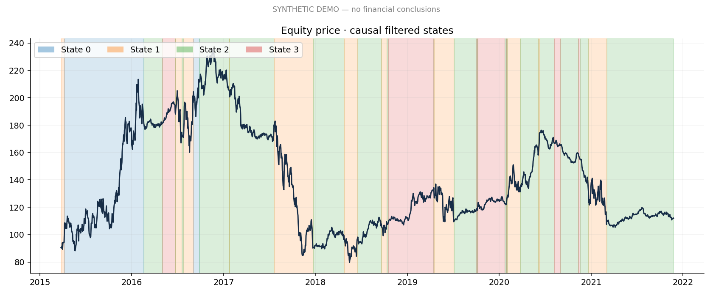

# Metis
### Unsupervised discovery of financial market regimes

Metis investigates whether latent market states can help explain risk and improve portfolio drawdown management. It compares K-Means, Gaussian mixtures and a diagonal Gaussian hidden Markov model, then evaluates a probability-weighted allocation on a chronological holdout.

**Status:** executable research implementation with tested synthetic demonstration. No real-market performance claims have been established. All committed demonstration results are synthetic.

## Quick start

Python 3.10–3.12 recommended.

```bash
pip install -r requirements.txt
python -m unittest discover -s tests -v
python run.py --demo --out outputs/demo
python run.py --download --out outputs/historical
# Or use a reviewed, locally available historical dataset:
python run.py --csv data/raw/market.csv --out outputs/historical
```

The standalone notebook is `notebooks/metis_kaggle.ipynb`. Upload it to Kaggle and run all cells. It embeds the source code, runs in synthetic mode by default and can use an attached CSV without internet. Change its settings to run historical research.

## Research question

Can unsupervised models discover persistent financial environments, and does their information help manage risk after trading costs? No crash prediction or stock-price forecast is assumed.

## Dataset

CSV contract: `date,equity,bonds` plus optional positive price/index columns `gold,oil,dollar,vix`. Use adjusted total-return-compatible equity and bond prices. Dates must be unique, ascending after loading, with complete observations. Missing prices are rejected rather than silently interpolated. Volume and yields need their own explicit adapters and are not treated as price series.

The optional downloader requests adjusted SPY, IEF, GLD, USO, UUP and VIX closes through yfinance. The common start is constrained by asset inception; it cannot promise a 2005 start. It takes complete common sessions and writes provenance beside the CSV. Inspect missing dates and market calendars. Adjacent retained observations may span more than one session. Annualization assumes 252 observations/year. Yahoo access and redistribution are subject to provider terms. Raw financial data is not bundled.

## Methodology and feature engineering

Trailing returns at 1/5/20/60 sessions, realized volatility, short/long volatility ratio, distance from a trailing 252-session high, 60-session cross-asset correlations, and cross-asset daily changes. Momentum is represented by cumulative returns to avoid exact duplicate features. Scalers and PCA fit training observations only.

Default historical partitions: training through 2018, validation 2019–2021, test 2022 onward. The pipeline enforces at least 100 usable observations per partition. Synthetic runs use 60/20/20 chronological splits. Dates and settings are saved in `run_manifest.json`.

## Models and model comparison

- **K-Means:** 2–6 states, validation silhouette and alternate-seed adjusted Rand stability.
- **GMM:** diagonal covariance with probability estimates; validation log likelihood and silhouette.
- **HMM:** a readable NumPy/SciPy diagonal Gaussian EM implementation with log-space inference, covariance floors and a learned transition matrix.

The main HMM state count is chosen by validation likelihood within the HMM family. K-Means distances and probabilistic log likelihoods are not comparable across families. Silhouette is descriptive, not proof of financially useful regimes. No test returns select the model. The trained model stays frozen throughout validation and test; this is a fixed chronological holdout, not a walk-forward refit.

## Discovered regimes and transition dynamics

State IDs have no predefined financial meaning. Training-period profiles rank states by realized equity volatility. Neutral labels preserve that distinction: a high-volatility state is not automatically a crisis. Filtered probabilities, confidence/entropy, learned transition matrix and observed state-run durations are exported. Boundary runs are censored and identified in the duration table. HMM transition probabilities describe latent dynamics; observed argmax transitions need not match them.

Historical annotations may be added only after fitting. Training-period plots are retrospective descriptions because parameters were estimated using the full training period. Validation/test filtering uses a frozen fit and only contemporaneously available features.

## Portfolio experiment

Compare buy-and-hold equity, fixed 60/40 equity/bonds, and a probability-weighted regime allocation. Training volatility ranks map to configurable equity weights (default 80/60/30/10%, interpolated for other state counts). The complement goes to bonds. Bonds are risky and may fall with equities.

**Timing:** a signal calculated after close t executes at close t+1 and first earns the close t+1 to t+2 return. Each test portfolio starts in cash. Daily target rebalancing includes weight drift, initial purchases and full L1 traded risky-asset notional. Selling one asset and buying another incurs costs on both legs. Fees use an iterative post-fee NAV calculation. No terminal liquidation is charged. Idle cash earns zero. Transaction costs are a simplified proportional estimate; liquidity, taxes, market impact and separate slippage are not modeled.

## Results

No real-market conclusion is available yet. Run on historical data to generate your results. The bundled demo report is a software check only: [synthetic demo report](outputs/demo/results/REPORT.md).

Exports include annualized return/volatility, zero-risk-free-rate Sharpe, zero-target Sortino, drawdown, Calmar, turnover and costs. `sum_cost_fractions` is a sum of period NAV-relative costs, not compounded wealth drag. Gross and net return series allow cost comparisons. Per-state performance is grouped by the decision state known before the return; fragmented groups are not presented as standalone compounded strategies.

## Visualizations



Sixteen consistent figures cover regime price shading, timeline, feature profiles, transition matrix, probabilities, train-fitted PCA, drawdowns, equity curves, rolling Sharpe/volatility, durations, state returns, feature correlations, return distribution, realized volatility and cross-asset correlations. All synthetic figures carry a demo label.

## Robustness and what can fail

State counts are compared on validation. Feature-window and shortened-training-period checks are also evaluated on validation. Cost and allocation sensitivity is reported on the test period as exploratory analysis, not a license to pick the winning test configuration. Overlapping windows and correlated features violate convenient independence assumptions; diagonal Gaussian emissions are an approximation. Crisis samples may be sparse; labels can change across fits, and volatility sorting does not resolve every semantic mismatch. More states can fragment the data. GMM/HMM local optima and EM convergence deserve inspection. The manifest includes the HMM likelihood trace.

A strategy can lose to both benchmarks, and modest rule changes can eliminate its apparent advantage. Report these failures. No statistical significance, causal benefit or crash-prediction claim follows from one backtest.

## Leakage & Backtest Integrity

- Trailing features only; prefix-invariance test.
- Training-only scaling, PCA and volatility ranking.
- Validation-only HMM state-count selection.
- Online forward probabilities for decisions; **no smoothed posterior or Viterbi path**.
- Frozen parameters; chronological validation/test continuation.
- One full close-to-close execution delay; tested with a price-jump example.
- Initial fees and drift-aware turnover tested.
- Fixed asset universe still reflects researcher selection; ETF proxies do not eliminate selection bias.
- Current adjusted histories can be revised; this is not a point-in-time institutional database.
- No test-set optimization or historical event labels in training.

## Reproducibility and limitations

Seed and configuration are saved per run. `requirements.txt` supplies compatible dependency ranges; `environment-tested.txt` records versions used for local verification. For exact reproduction, lock your own platform environment and keep a checksum of the chosen input CSV. Never load an untrusted pickle from `outputs/models`. Numerical outcomes may vary across library versions.

## Future work

Walk-forward refitting with state matching, block-bootstrap uncertainty, multiple HMM initializations, richer covariance structures, point-in-time data, calendar-aware execution, and a separately validated regime-instability score. These extensions are deliberately not claimed as implemented.

## Layout

`src/` contains data ingestion, trailing features, model comparison, HMM, backtest, metrics, visualization and orchestration. `tests/` checks causal inference and accounting. `run.py` is the CLI. `config.yaml` controls the experiment. `notebooks/` contains the self-contained Kaggle version. `outputs/` stores generated research artifacts.
